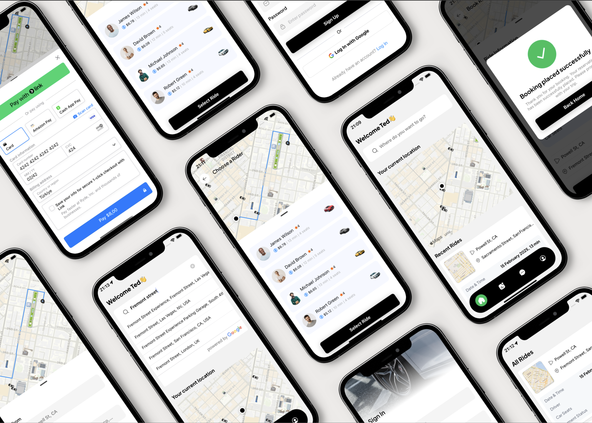

# 🚖 Uber Clone

 

## 📌 Project Overview

A full-stack ride-hailing mobile application featuring real-time driver tracking, fare estimation, and secure payments.

## 🏆 Core Features

- **✔️ User Authentication**  
  Clerk integration with email verification flow
- **✔️ oAuth Using Google**  
  Easy login using Google credentials.
- **✔️ Real-time Driver Tracking**  
  Interactive map with live driver positions (Geoapify + Google Maps)
- **✔️ Intelligent Search**  
  Google Places Autocomplete for destination selection
- **✔️ Secure Payments**  
  Stripe integration for PCI-compliant transactions
- **✔️ State Management**  
  Zustand for efficient global state handling
- **✔️ Cloud Database**  
  NeonDB PostgreSQL for reliable data storage

## 🛠️ Tech Stack

### Frontend

- 🚀 React Native (with Expo) - Cross-platform development
- ⚡ TypeScript - Type-safe coding
- 🗺️ Google Maps SDK - Map visualization
- 🏗️ Zustand - State management

### Backend Services

- 🗄️ NeonDB - PostgreSQL database
- 🔑 Clerk - Authentication
- 💳 Stripe - Payment processing

### APIs

- 🌎 Google Places API - Location search
- 📍 Geoapify API - Geocoding services
- 📱 Expo Location - Device positioning

## 🔧 Installation & Setup

### 1️⃣ Clone Repository

```bash
git clone https://github.com/yourusername/uber-clone.git
cd uber-clone
```

### 2️⃣ Install Dependencies

Install the project dependencies using npm:

```bash
npm install
```

### ️3️⃣ Set Up Environment Variables

Create a new file named `.env` in the root of your project and add the following content:

```env
EXPO_PUBLIC_CLERK_PUBLISHABLE_KEY=
DATABASE_URL=
EXPO_PUBLIC_SERVER_URL=
EXPO_PUBLIC_GEOAPIFY_API_KEY=
EXPO_PUBLIC_GOOGLE_API_KEY=
EXPO_PUBLIC_STRIPE_PUBLISHABLE_KEY=
STRIPE_SECRET_KEY=
```

### 4️⃣ Start the app

```bash
npx expo start
```
